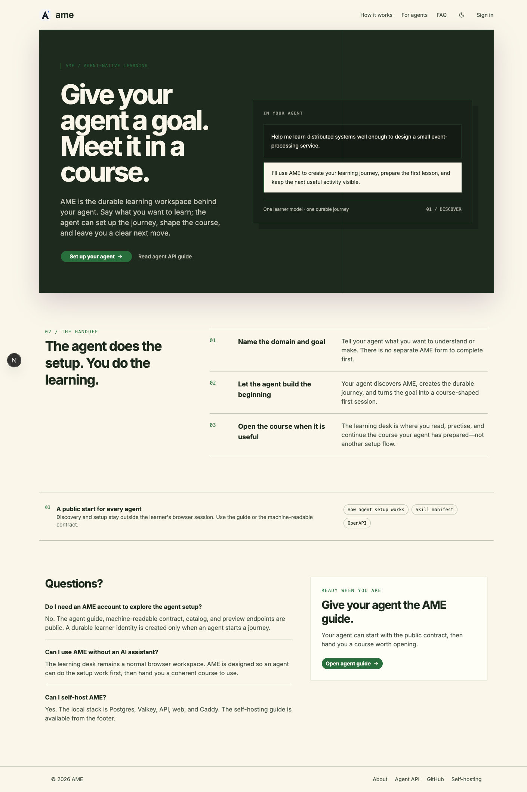
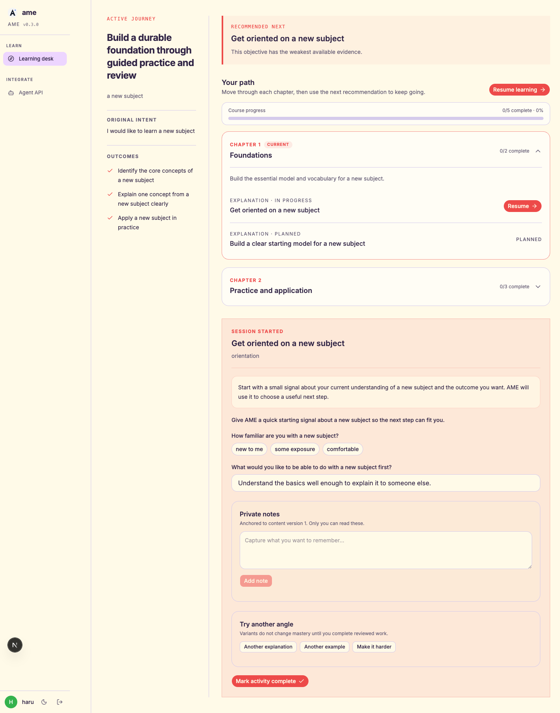
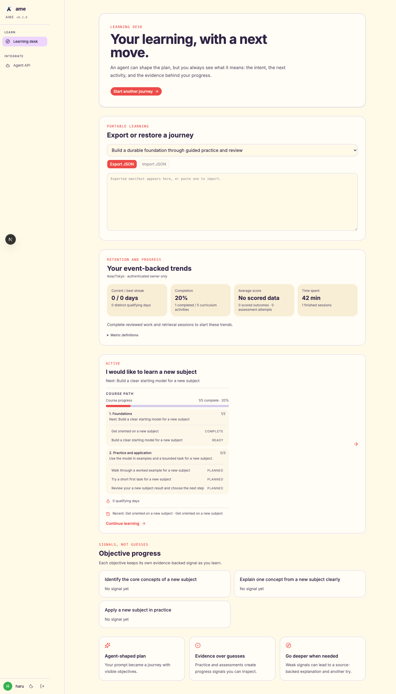

# ame — study, sweetened

Agent-friendly learning platform with one owner-scoped journey API. Rust (Axum) backend, Next.js (App Router) frontend, Postgres.

**Stack**: Rust 2024 · Axum 0.8 · sqlx · Next.js 16 · React 19 · Bun · TypeScript · Tailwind CSS · Postgres 18

**License**: [GPL-3.0](./LICENSE)



<details>
<summary>More screenshots — active session, learner analytics</summary>





</details>

## Quick start

The toolchain is provided by [mise](https://mise.jdx.dev) — run `mise install`
once (tools then activate automatically on `cd` into the repo, or explicitly
via `mise x -- <command>` in non-interactive shells), then:

```bash
make init-env       # web deps + Playwright browsers (toolchain comes from mise)
make db-up          # start Postgres in Docker or Podman
make dev            # API on :28080, frontend on :23000
make db-seed        # seed the current learner journey fixture (requires API running)
```

Demo credentials after seeding: `haru@example.com / password123` (learner),
`admin@example.com / password123` (admin).

### Admin users

Registration only ever grants the `user` role — there is no API path to self-register
as an admin (`POST /public/v1/auth/register` rejects `role: admin`). Admins are granted
**directly in the database**:

```bash
make db-admin                                  # create/grant admin@example.com (default)
make db-admin ADMIN_EMAIL=you@example.com      # promote your own account (password untouched)
```

`db-seed` depends on `db-admin`, so the local admin exists before the current
learner fixture runs. After being promoted, log
out and back in to refresh the session.

Copy `.env.example` to `.env` if you need to override defaults.

### Containerized local stack

Use the debug stack when you want the complete local topology behind Caddy:

```bash
make local-up       # Caddy + web + API + Postgres + Valkey at :28800
make local-uiux     # run the focused browser smoke test through Caddy
make local-down     # stop services; keep the named Postgres volume
```

The web service bind-mounts `web/` and runs Next.js in development mode with
polling enabled, so edits on macOS/Podman trigger hot reload without rebuilding
the image. API source changes use the same bind-mounted development workflow.

### Learning desk, themes, and local simulations

`/learning` is the signed-in learner's private course library. It shows the
learner's own course plans, their recommended next activity, progress, and
reviews. It never shows courses owned by another account — including disposable
local mock journeys — so an empty desk is an invitation to create a course, not
a missing shared catalog.

Paper & Moss is the default theme for a new browser. Learners can select a
different theme from the interface; their saved choice takes precedence over
the default.

To create a browser-visible, disposable three-round learner simulation, choose
the password locally and run:

```bash
HARU_SIM_PASSWORD='choose-your-own-password' make local-haru-simulation
```

The command prints the journey URL and a non-secret login email. It never saves
or prints the password, and its courses remain visible only when you sign in as
that simulated learner.

## Common tasks

```bash
make check          # fmt-check + lint + unit tests (pre-commit gate)
make ci             # check + DB-backed tests + db-reset + e2e (full gate)
make test-db        # DB-backed integration tests (requires `make db-up`)
make db-reset       # wipe DB data, recreate, migrate (fixes migration checksum conflicts)
make openapi        # regenerate api/openapi.yaml + web TypeScript schema
```

Install the pre-commit hook with `make hooks-install`.

## E2E tests

```bash
make e2e            # auto-starts API + seeds + runs Playwright suite
```

For interactive visual audits use `bunx @playwright/cli` — see `CLAUDE.md` for the auth cookie pattern.

## Deploy

`docker-compose.prod.yml` is a production-shaped stack (Postgres + Valkey + API + web) for
smoke deploys, demos, and CI integration testing — not a substitute for the k8s
manifests. The API runs its migrations on boot, so no separate migration step is
needed.

For a single-host self-hosted installation, follow
[`docs/public/self-hosting.md`](docs/public/self-hosting.md). The public
`/public/llms.txt` file is the agent discovery contract, served statically by
the recommended proxy rather than by the API.

```bash
cp .env.example .env   # set POSTGRES_PASSWORD (and NEXT_PUBLIC_API_URL for the web bundle)
make docker-build      # build api + web images
make docker-up         # start the stack (-d)
make docker-logs       # tail logs
make docker-down       # stop the stack
```

## Local database

Postgres runs in Docker or Podman (auto-detected by the Makefile). On macOS, [Colima](https://github.com/abiosoft/colima) or Docker Desktop works.

```bash
make db-up
# ... work ...
make db-down
```

## Layout

- `api/` — Rust backend (Axum, sqlx).
- `web/` — Next.js frontend (App Router, Tailwind CSS and local shadcn-style primitives).
- `db/` — `docker-compose.yml` + sqlx migrations.
- `design/source/src/*.jsx` — pixel-faithful UI design source of truth.
- `docs/specs/` — supporting design and schema specifications.
- `docs/plans/` — implementation plans.
- `docs/public/` — canonical public-facing operator, deployment, and agent docs.
- `docs/ROADMAP.md` — the current agent-first release roadmap.
- `.tmp/` — gitignored scratch space for screenshots and Playwright artifacts.

## Roadmap

[`docs/ROADMAP.md`](docs/ROADMAP.md) tracks the next release: **v0.5.0 —
agent-authored courses**. The 0.3.1 foundation supplies the durable learner
API, assessment, evidence, provenance, and self-hosted stack. 0.5.0 makes
those primitives usable by agents to assemble, validate, publish, and adapt
real source-grounded courses, proven with complete Flink and Netty references.

## Contributing

See [`CONTRIBUTING.md`](./CONTRIBUTING.md) for setup, conventions, and the test workflow. Security issues: see [`SECURITY.md`](./SECURITY.md).

`CLAUDE.md` is the full working agreement — stack, conventions, shell discipline, data-model constraints, and the agent/e2e playbooks (written for AI assistants but useful for humans too).
